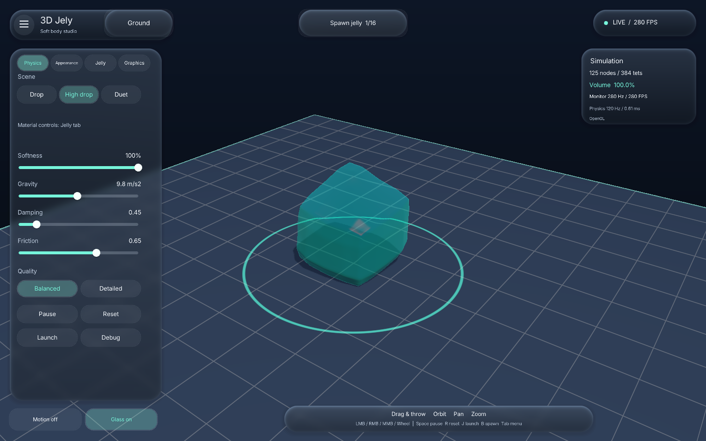

# 3D Jelly Physics

A C++20 interactive 3D soft-body laboratory with translucent jelly, elastic dragging,
random shapes, customizable lighting and ground, and an animated glass-style interface.




## Download and run

The current project version is **1.9.2**
for the latest Softness and low-FPS dragging fixes. Version 1.9.0 remains available as a fallback.
The Windows x64 executable embeds shaders, fonts and the optional graphics runtime;
no browser, compiler or asset folder is required. A working OpenGL 3.3 graphics driver is required. Vulkan mode uses
real hardware Vulkan through ANGLE and needs a compatible Vulkan driver.

## Features

- Real simulated tetrahedral XPBD bodies, not predefined deformation animations.
- Softness from a rigid stone endpoint to stretching, compressing, spring-like jelly, with smooth elastic hardening under large deformation.
- Left-click dragging and throwing, gravity, friction, damping, collisions and sleep.
- A new random physical shape and independent color with each **Spawn jelly** / **B** press.
- Adjustable transparency, refraction, tint and highlights.
- A 24-hour lighting cycle, contrast and independent background/ground colors.
- Ground width/depth, grid/checker patterns, roughness, outline and ring controls.
- Animated Liquid Glass-inspired controls with collapse/reopen, reduced motion and solid UI.
- Monitor-aware rendering/VSync, independent of the fixed 120 Hz physics solver.
- Native OpenGL or verified ANGLE/hardware Vulkan on supported platforms.

## Controls

Left mouse grabs jelly; right mouse orbits; middle mouse pans; the wheel zooms.
**B** spawns, **Space** pauses, **N** single-steps while paused, **R** resets,
**J** launches, **Tab** folds/unfolds controls, **F1** shows debug data,
**F11** toggles borderless fullscreen and **Esc** exits.

## Build

Source is in [`Code/`](Code/); architecture and validation records are in [`Docs/`](Docs/).

```sh
cmake -S Code -B Code/build/headless -DJELY_BUILD_APP=OFF -DCMAKE_BUILD_TYPE=Release
cmake --build Code/build/headless --parallel 2
ctest --test-dir Code/build/headless --output-on-failure
```

For Windows, open `Code` with Visual Studio 2022 C++/CMake, or run
`Code/bootstrap_tools.ps1` followed by `Code/build_release.ps1` for the pinned portable
toolchain. Native Linux/macOS instructions and package layouts are documented in
[`Docs/compatibility.md`](Docs/compatibility.md). Detailed controls, CLI tests and
build switches are in [`Code/README.md`](Code/README.md).

## Compatibility and scope

Windows AMD hardware is locally tested with both APIs. Linux has OpenGL and pinned
x64/arm64 ANGLE/Vulkan support; macOS has a native OpenGL universal app. Native CI
builds/tests pass Windows/MSVC, Linux x64, Linux ARM64 headless and macOS universal;
Linux x64 graphics smoke uses software Mesa/Xvfb, not a physical GPU.
**macOS Vulkan is not implemented.** Neither source portability nor CI compilation
proves runtime behavior on all AMD/NVIDIA/Intel drivers; see the recorded test boundary.

The physics is a real-time numerical approximation, not a calibrated model of a
particular real jelly. Contacts are particle-based, optical effects are screen-space,
and extreme deformation is safeguarded by dissipative backtracking. The simulation
does not claim exact real-material fidelity, self-collision or continuous surface
collision. Maximum simultaneous bodies is 16; this bounds resource growth, not a
guaranteed frame rate. The ground is a bounded arena, not an unsupported ledge.

## License

Original project code and documentation are under the [MIT License](LICENSE).
Third-party components retain their own licenses and copyright notices; see
[`THIRD_PARTY_NOTICES.md`](THIRD_PARTY_NOTICES.md). The app's `--licenses` command prints
embedded font/graphics notices. No dependency is relicensed under MIT.

## Direct Windows download

**[Download the Windows x64 build — v1.9.1](https://github.com/klygam-hue/3D-Jelly-Physics/actions/runs/37952202462)**

Open **Artifacts**, download the Windows x64 artifact, extract the ZIP,
and run its application executable. This updated 1.9.1 build includes the high-Softness and 10–15 FPS dragging fixes.
GitHub sign-in is required for Actions artifact downloads.

[View the v1.9.1 release notes](https://github.com/klygam-hue/3D-Jelly-Physics/releases/tag/v1.9.1).


## Android and M-series iPad — 1.9.2

Native mobile source is in [Mobile/](Mobile/README.md), with touch controls and the same 120 Hz physics and low-FPS dragging fix. The application version is **1.9.2**.

| Platform | Target | Package and installation |
|---|---|---|
| Android | Android 8.0+, ARM64/x86_64, OpenGL ES 3.0 | Native test-signed APK built in the cloud; GitHub distribution pending |
| iPad with an M-series chip | iPadOS 16+, arm64, landscape | IPA build pending macOS/Xcode; installation requires Apple signing/provisioning |

**Build status:** Android SDK compilation, signature verification and 16 KB archive/ELF alignment checks pass. Android API 26 emulator validation passes (120 frames, 240 physics steps, zero OpenGL errors and a verified screenshot). Physical Android devices are not yet tested. iPad compilation and simulator validation remain pending macOS/Xcode access. No mobile download has been published on GitHub yet. Download links will be added here after publication. See [validation records](Mobile/VALIDATION.md).

One finger grabs jelly or orbits empty space; two fingers orbit/pinch to zoom; three fingers pan. Adaptive controls include Physics, Jelly, Scene, Ground and Tools. See [mobile build and installation instructions](Mobile/README.md) for requirements, signing, development-certificate limitations and the exact validation boundary.

On macOS with Xcode, CMake and Python, the prepared device builder is `python3 Mobile/build_ipad.py`. It will package an unsigned IPA only after validating the compiled device app. [Mobile update notes for 1.9.2](Mobile/RELEASE_NOTES_1.9.2.md) record shipped Android work and pending iPad validation.
